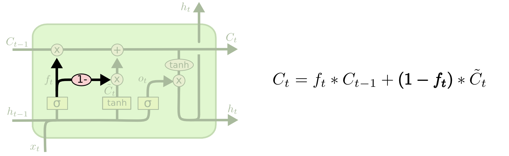

原文地址[http://colah.github.io/posts/2015-08-Understanding-LSTMs/](http://colah.github.io/posts/2015-08-Understanding-LSTMs/) ,本文算是学习笔记,有理解不对的地方欢迎指正

### Recurrent Neural Network

人类在阅读文章时，对于一个词的理解往往是基于先前的词。也就是说，人类在学习知识时记忆和思维有一定的持久性。

传统的神经网络不具备这种功能，例如在对视频每一帧图片发生事件分类时，传统的神经网络把每一帧图片分开考虑，并不会考虑先前的帧。

循环神经网络解决了这一问题，它们在网络中加入循环，使得信息具有一定的持久性。

​						     	**Recurrent Neural Networks have loops**

上图所示A为神经网络的一个chunk，$x_t$为输入，$h_t$为输出。和传统的神经网络不同的是，该图多了一个循环,这个循环使得信息可以传递到下一步。

实际上，该网络和普通的神经网络并无不同，**循环神经网络可以看作是同一网络块的多个复制** ，每个网络块将信息传递给它的下一个块。若将上图的循环展开，则如下图所示。

​							**An unrolled recurrent neural network**

近年来，循环神经网络得到广泛应用，使用循环神经网络的领域包括但不限于:语音识别，语言模型，机器翻译等。

LSTMs是一种非常特殊的循环神经网络，对于大多数任务，LSTMs都优于传统的RNNs，下面讨论LSTMs。

### The Problem of Long-Term Dependencies

RNNs的一个观点是，优化当前任务可以利用先前的信息，例如视频任务，可以利用先前帧的信息来理解当前的帧。但RNNs是否能像我们想象一般地很好地处理该任务呢?

对于只需要利用最近一段时间的任务，例如，一个预测下文的语言模型，只需要根据上一个单词来预测当前单词。假设我们现在预测"the clouds are in the ***sky***,"中单词的下一个单词，我们不需要很多的上下文。这种情况下，相关信息之间的间距很小，RNNs的效果比较好。

但是很多情况下，我们需要更多的上下文信息。例如我们在预测"I grew up in France... I speak fluent ***French***" 。近处的上下文信息告诉我们，下一个单词是某种语言，但是如果没有更多的上下文信息(到France)，我们无法确定到底是何种语言。

当需要的信息距离当前很远时，RNNs就无法捕捉到这些有用的信息。

理论上RNNs仍然可以捕捉距离很远的信息，这种问题通常称为"Long-term dependencies." 然而实际上，RNNs在处理这种长期依赖问题上表现糟糕。长期依赖的根本问题在于梯度消失和梯度爆炸，当网络变深时，多阶段传播后的梯度倾向于消失(大部分情况下)或爆炸(少部分情况，影响优化过程), 详见[Hochreiter,1991a;](http://people.idsia.ch/~juergen/SeppHochreiter1991ThesisAdvisorSchmidhuber.pdf)  [Bengio et al., 1994a](https://www.ncbi.nlm.nih.gov/pubmed/18267787),。

相同函数的多次组合，可以导致极端非线性行为，而循环神经网络所使用的函数组合类似于矩阵乘法

$$h^{(t)} = W^Th^{(t-1)}$$

可以认为该式子是一个非常简单的、缺少非线性激活函数和输入$x$的循环神经网络。该式子可以简化为

$$h^{(t)} = (W^t)^Th^{(0)}$$

当W符合下列形式的特征分解时

$$W = Q\Lambda Q^T $$

其中，Q正交，原式可化为

$$h^{(t)} = Q^T\Lambda^t Qh^{(0)}$$

其中，$\Lambda$为特征值的对角矩阵。当t很大时，若特征值大于1则会爆炸，若特征值小于1则会消失。这就是RNNs存在长期依赖的问题。

针对RNNs存在的长期依赖问题，研究人员提出LSTMs

## LSTM Network

LSTM是一种特殊的RNN,能够处理长期依赖问题，该模型默认记忆长期的信息。所有的循环神经网络由重复的神经网络模块组成。在一般的RNNs中，重复的模块结构非常简单，例如仅仅是一个tanh激活层。

​				**The repeating module in a standard RNN contains a single layer**

LSTMs同样有着相同的链式结构，但是内部结构有所不同。与一般的RNNs的单层结构不同的是，LSTMs每个重复单元内部有4层，这4层以一种非常巧妙的方式连接。

​				**The repeating module in an LSTM contains four interacting layers.**

接下来详细解释LSTM单元的内部构造，为了方便说明，事先规定如下符号。

## The Core Idea Behind LSTMs

LSTMs的主要贡献在于引入自循环的巧妙构思，已产生梯度长时间持续流动的路径。LSTMs的关键是cell state，即图中从左到右的箭头。

cell state类似于传送带。它贯穿整个链式结构，仅仅使用一些简单的线性操作连接。这样信息在cell state上流动就不会发生较大的改变。

得益于一种被称为“门”的结构，LSTM能够增加或删除传送到cell state的信息。“门”可以有选择地让信息通过。“门”由sigmoid层和乘法操作构成。

sigmoid层的输出为一个0~1之间的数字，描述每个组件有多少信息应该通过。0表示不允许任何信息通过，1表示允许所有的信息通过。

一个LSTM单元有3个门，来控制cell state。

## Step-by-Step LSTM Walk Through

**LSTM的第一步**是决定那些信息应该被遗忘，由一个别称为“遗忘门”的sigmoid层决定。将$h_{t-1}$和$x_t$ 输入到遗忘门，对$C_{t-1}$中的每个数，得到一个0~1之间的数字，1表示”完全保留该信息“，0表示”完全丢失该信息“。

回忆刚才预测下一个单词的语言模型。在这样一个问题中，当前的cell state可能包含了当前主体的性别信息，利用该信息，可以选择正确的物主代词。当前词变成另一个主体后，我们想要遗忘掉先前主体的性别信息，这就是遗忘门的作用。

**LSTM的下一步**是决定我们要存储哪些新的信息到cell state中。由”输入门“决定。输入门由两部分组成，首先，一个sigmoid层决定哪些信息被更新。接着，一个tanh激活函数得到一个新的候选值$\tilde{C}_t$ ，$\tilde C_{t}$ 中每个数根据sigmoid的输出决定是否加入到cell state中 。也就是说，最后，将sigmoid的输出和正切函数的输出结合，更新得到新的cell state。

仍然使用上文中提到的语言模型作为例子 ，我们想将新的主体的性别信息加入到cell state中，来替换被遗忘的旧的性别信息。

那么是如何将旧的cell state$C_{t-1}$更新得到新的cell state $C_t$呢？

将旧的cell state $C_{t-1}$与遗忘门的输出$f_t$相乘，遗忘掉我们决定要遗忘的东西。再与$i_t* \tilde C$相加，即加上我们决定要添加的信息。

对应到语言模型的例子，这个过程就是遗忘掉旧的主体的性别信息，加上新的主体的性别信息，如我们之前的步骤所决定的那样。

**最后**，我们需要决定输出什么东西。最后的输出基于cell state,但经过一定过滤。首先，利用一个sigmoid层决定cell state的哪些部分需要被输出。然后将cell state输入到一个正切激活函数(将输出值压到-1~1之间)，将正切函数的输出和sigmoid函数的输出相乘，得到输出。

对应到语言模型的例子，因为当前看到的是主语，那么我们可能期望输出和动词相关的信息，例如，输出主语是单数还是复数。这样我们就能知道接下来的动词的形式。

## Variants on Long Short Term Memory

以上所述的LSTM是非常普通的LSTM。并不是所有的LSTMs都是上述形式。事实上，几乎每篇论文中的LSTMs都有着微小的差别。改动非常小，但有些值得一提。

一种非常流行的LSTM变种，由[Gers & Schmidhuber (2000)](ftp://ftp.idsia.ch/pub/juergen/TimeCount-IJCNN2000.pdf)提出，该LSTM加入"peephole connnections"。这意味着gate layer可以直接看到cell state。

上图所示所有的门都添加了peephole，但有些论文中只在部分门添加peephole。

另一个变种是将遗忘门和输入门组合，而不是分开决定哪些需要遗忘哪些需要添加。只遗忘我们将要用信息替换旧信息的部分。只在我们需要遗忘的地方加入新的信息。

​	

另一个更加dramatic的变种就是大名鼎鼎的GRU(Gated Recurrent Unit)[Cho, et al. (2014)](http://arxiv.org/pdf/1406.1078v3.pdf)。 GRU将遗忘门和输入们组合成一个"更新门"。同时，GRU还将cell state和hidden state结合，除此之外一些其它的改动。GRU要比普通的LSTM模型简单，并且越来越受欢迎。

另外一些LSTM,改动比较大，例如Depth Gated RNNs by [Yao, et al. (2015)](http://arxiv.org/pdf/1508.03790v2.pdf). 还有一些完全不同的方法，例如

Clockwork RNNs by [Koutnik, et al. (2014)](http://arxiv.org/pdf/1402.3511v1.pdf).

那么哪些结构是最优的，[Greff, et al. (2015)](http://arxiv.org/pdf/1503.04069.pdf)比较了几种流行的变种，发现大部分是相同的。[Jozefowicz, et al. (2015)](http://jmlr.org/proceedings/papers/v37/jozefowicz15.pdf)测试了上万种RNN架构，发现有些架构在特定的任务上确实能表现得更好。

## Conclusion

不翻译，原文写得很好，推荐看一下。

> Earlier, I mentioned the remarkable results people are achieving with RNNs. Essentially all of these are achieved using LSTMs. They really work a lot better for most tasks!
>
> Written down as a set of equations, LSTMs look pretty intimidating. Hopefully, walking through them step by step in this essay has made them a bit more approachable.
>
> LSTMs were a big step in what we can accomplish with RNNs. It’s natural to wonder: is there another big step? A common opinion among researchers is: “Yes! There is a next step and it’s attention!” The idea is to let every step of an RNN pick information to look at from some larger collection of information. For example, if you are using an RNN to create a caption describing an image, it might pick a part of the image to look at for every word it outputs. In fact, [Xu, *et al.* (2015)](http://arxiv.org/pdf/1502.03044v2.pdf) do exactly this – it might be a fun starting point if you want to explore attention! There’s been a number of really exciting results using attention, and it seems like a lot more are around the corner…
>
> Attention isn’t the only exciting thread in RNN research. For example, Grid LSTMs by [Kalchbrenner, *et al.* (2015)](http://arxiv.org/pdf/1507.01526v1.pdf) seem extremely promising. Work using RNNs in generative models – such as [Gregor, *et al.* (2015)](http://arxiv.org/pdf/1502.04623.pdf), [Chung, *et al.*(2015)](http://arxiv.org/pdf/1506.02216v3.pdf), or [Bayer & Osendorfer (2015)](http://arxiv.org/pdf/1411.7610v3.pdf) – also seems very interesting. The last few years have been an exciting time for recurrent neural networks, and the coming ones promise to only be more so!
